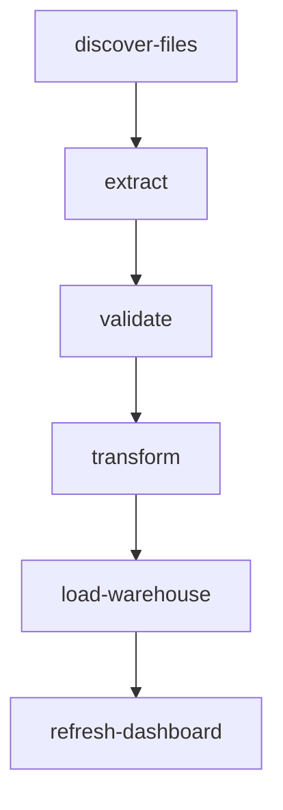

# etl

A linear-ish extract / transform / load DAG for analytics batches. Built
programmatically in [`main.go`](./main.go).

## Pipeline shape

Files are discovered, extracted, validated, and rejected rows are recorded.
Accepted rows are transformed into normalized staging tables, loaded into
the warehouse, and finally the BI dashboard that consumes the warehouse
table is refreshed.

## DAG diagram



## Notable configuration

- `ConcurrencyLimit: 2` — keeps warehouse load balanced.
- `load-warehouse` aborts the run if there are no accepted rows, which is
  useful for catching upstream validation issues before the warehouse
  pipeline touches anything.
- The `Metrics` map produced by `transform` is consumed by `load-warehouse`
  to decide whether to proceed, showing how state flows forward through
  generic Go structs.

## Run

```bash
cp ../../.env.example ../../.env
go run .
```

## Passing initial state (typed `Run`)

[`main.go`](./main.go) seeds the batch metadata in `runDAG` via
`GlobalInputs` before `discover-files` runs:

```go
run, err := orch.Run(ctx, d, orchestrator.GlobalInputs[RunState]{
    Value: RunState{
        BatchID:      "batch_2026_06_06_orders",
        SourceSystem: "shopify",
        RawFiles: []string{
            "s3://raw/orders/2026-06-06/orders-0001.json",
            "s3://raw/orders/2026-06-06/orders-0002.json",
        },
    },
})
```

`discover-files` logs the already-seeded files and returns state unchanged.
