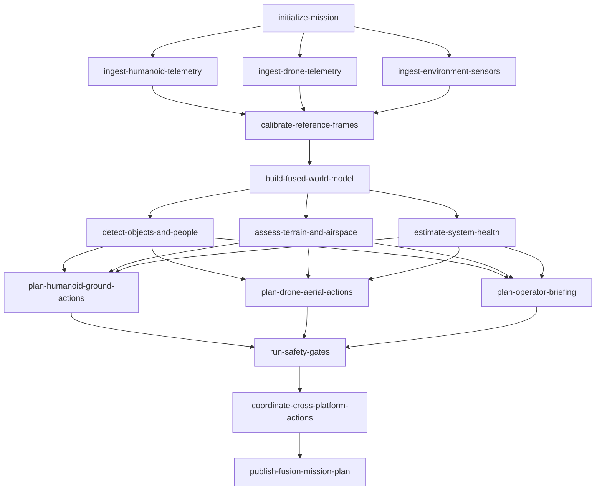

# humanoid-drone-fusion-yaml

A multi-robot fusion planning DAG: a humanoid robot and a drone cooperate on
a site survey. The DAG is declared in [`dag.yaml`](./dag.yaml) and executed
by [`main.go`](./main.go).

## Pipeline shape

The mission is initialized, then three telemetry streams (humanoid, drone,
environment) are ingested in parallel. Reference frames are calibrated and
a fused world model is built. Three perception tasks fan out: object /
person detection, terrain and airspace assessment, and system health
estimation. From those, three planners produce per-platform plans and an
operator briefing. Safety gates are checked, a cross-platform timeline is
coordinated, and the plan is published.

## DAG diagram



## Notable configuration

- `concurrency_limit: 4` to take advantage of the wide fan-out (three
  telemetry ingestions, three perception tasks, three planning tasks).
- Per-task timeouts on the telemetry ingestion (20s) and perception (25s)
  tasks.
- `run-safety-gates` is configured with `max_attempts: 2` and linear
  backoff, so a transient safety check can be retried once.

## Run

```bash
cp ../../.env.example ../../.env
go run .
```

## Passing initial state (typed `Run`)

[`main.go`](./main.go) seeds the mission envelope before the YAML DAG runs:

```go
run, err := orch.Run(ctx, d, orchestrator.GlobalInputs[RunState]{
    Value: RunState{
        MissionID:    "fusion_warehouse_survey_042",
        Area:         "north distribution yard",
        HumanoidID:   "humanoid-atlas-07",
        DroneID:      "drone-scout-12",
        SafetyPolicy: "human-in-the-loop, geofenced, non-contact inspection",
    },
})
```

`initialize-mission` logs the seeded identities and returns state unchanged.
