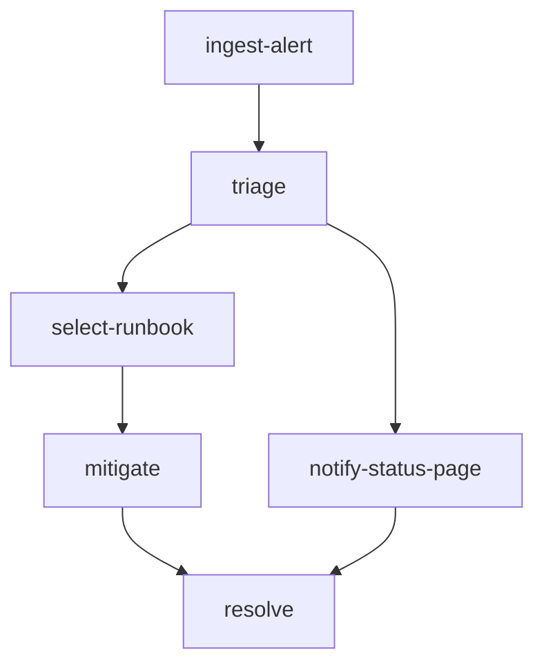

# incident-response

Site Reliability Engineering incident response workflow expressed as a DAG.
Built programmatically in [`main.go`](./main.go).

## Pipeline shape

After an alert is ingested, the on-call triages it and immediately posts a
status page update (so customers see something during mitigation). In
parallel, a runbook is selected, mitigation steps are applied, and finally
the incident is resolved with a note that ties the rollback version and the
status page copy together.

## DAG diagram



## Notable configuration

- `ConcurrencyLimit: 3` so customer communications can proceed in parallel
  with the technical mitigation.
- `mitigate` fails fast if no mitigation steps were selected — a guardrail
  preventing "resolved" incidents that never had a real fix.
- `resolve` demonstrates merging the technical outcome (`RollbackVersion`)
  with the customer-facing artifact (`StatusPageCopy`) into one final note.

## Run

```bash
cp ../../.env.example ../../.env
go run .
```

## Passing initial state (typed `Run`)

[`main.go`](./main.go) seeds the alert in `runDAG`:

```go
run, err := orch.Run(ctx, d, orchestrator.GlobalInputs[RunState]{
    Value: RunState{
        IncidentID: "inc_2026_0606_001",
        AlertName:  "checkout-api error budget burn",
        Service:    "checkout-api",
        Symptoms:   []string{"5xx rate above 8%", "payment authorization latency above 2s", "us-west checkout failures"},
    },
})
```

`ingest-alert` logs the seeded alert name and returns state unchanged.
