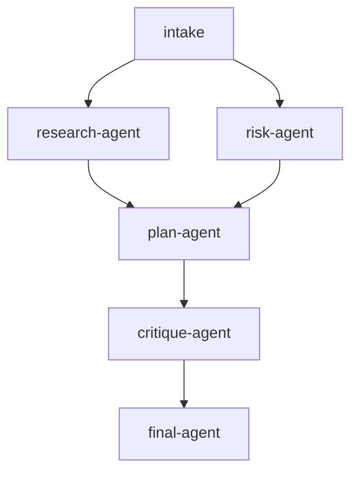

# llm-agent-dag-yaml

An LLM agent workflow declared as YAML. The DAG shape lives in
[`dag.yaml`](./dag.yaml), while [`main.go`](./main.go) loads the YAML,
registers Go task functions, configures the LLM clients, and runs the
orchestrator against a Postgres-backed run.

## Pipeline shape

`Topic` is seeded via `GlobalInputs` at run start; `intake` validates it.
After intake, `research-agent` and `risk-agent` fan out and run in parallel.
Both outputs converge in `plan-agent`, then `critique-agent` reviews the plan
and `final-agent` synthesizes the final answer.

## DAG diagram



## Notable configuration

- `concurrency_limit: 3` on the YAML DAG, allowing the research and risk agents
  to run at the same time.
- Every LLM agent task uses `max_attempts: 2` with linear backoff.
- Each agent uses `submit_result` as a structured output tool, so downstream
  tasks receive typed JSON instead of scraped assistant text.
- Agent clients are selected per role and memoized by typed Anthropic model ID,
  so agents with the same model setup reuse the same client instance.
- `MaxTokens: 1024` is set on each LLM call to avoid ending before the agent
  can call `submit_result`.

## Run

```bash
cp ../../.env.example ../../.env
# Set POSTGRES_DSN and ANTHROPIC_API_KEY in ../../.env
go run .
```

Optional per-agent model overrides:

```bash
RESEARCH_AGENT_MODEL=claude-haiku-4-5-20251001 \
RISK_AGENT_MODEL=claude-haiku-4-5-20251001 \
PLANNING_AGENT_MODEL=claude-sonnet-4-5 \
CRITIQUE_AGENT_MODEL=claude-sonnet-4-5 \
SYNTHESIS_AGENT_MODEL=claude-sonnet-4-5 \
go run .
```

## Passing initial state (typed `Run`)

[`main.go`](./main.go) seeds the topic before the YAML DAG runs:

```go
run, err := orch.Run(ctx, d, orchestrator.GlobalInputs[RunState]{
    Value: RunState{Topic: "launching an on-call handoff process for a payments platform"},
})
```

`research-agent` and `risk-agent` update different `RunState` fields in
parallel. `plan-agent` depends on both fields and joins the branch outputs.
