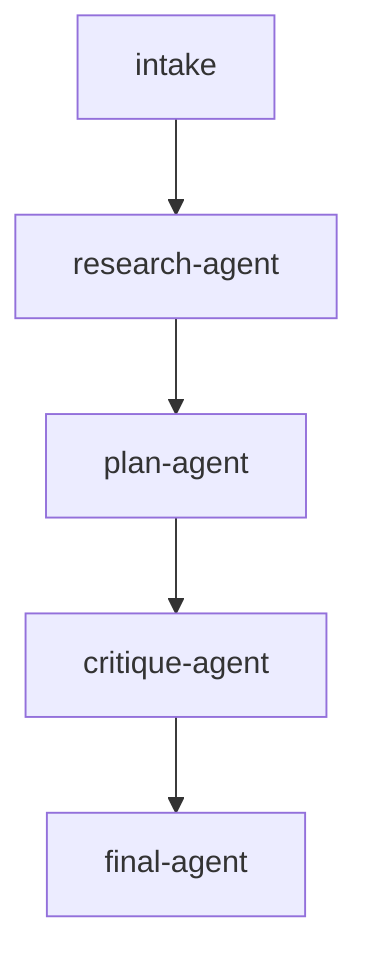

# llm-agent-dag

An LLM agent workflow built programmatically in Go (no YAML). The DAG is
constructed in [`main.go`](./main.go) by populating a `*dag.DAG[RunState]`
with `task.Task` values. Each agent task calls `pkg/llm.AgentLoopWithOptions`
and writes its structured result back into typed run state.

## Pipeline shape

`Topic` is seeded via `GlobalInputs` at run start; `intake` validates it.
`research-agent` creates a brief, `plan-agent` turns it into an execution
plan, `critique-agent` reviews the plan, and `final-agent` synthesizes the
final answer.

## DAG diagram



## Notable configuration

- `ConcurrencyLimit: 2` on the DAG, even though this specific graph is linear.
- Each agent uses `submit_result` as a structured output tool, so downstream
  tasks receive typed JSON instead of scraped assistant text.
- Agent clients are selected per role and memoized by typed Anthropic model ID,
  so agents with the same model setup reuse the same client instance.
- `MaxTokens: 1024` is set on each LLM call to avoid ending before the agent
  can call `submit_result`.

## Run

```bash
cp ../../.env.example ../../.env
# Set POSTGRES_DSN and ANTHROPIC_API_KEY in ../../.env
go run .
```

Optional per-agent model overrides:

```bash
RESEARCH_AGENT_MODEL=claude-haiku-4-5-20251001 \
PLANNING_AGENT_MODEL=claude-sonnet-4-5 \
CRITIQUE_AGENT_MODEL=claude-sonnet-4-5 \
SYNTHESIS_AGENT_MODEL=claude-sonnet-4-5 \
go run .
```

## Passing initial state (typed `Run`)

[`main.go`](./main.go) seeds the topic when starting the run:

```go
run, err := orch.Run(ctx, d, orchestrator.GlobalInputs[RunState]{
    Value: RunState{Topic: "launching an on-call handoff process for a payments platform"},
})
```

Each agent updates a different `RunState` field, so persisted task snapshots
show the handoff between agents.
