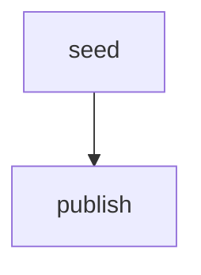

# minimal

The smallest end-to-end orchestrator run. Two tasks, a single dependency
edge, and nothing else. Useful as a starting point or a smoke test for
a fresh environment.

## Pipeline shape

`TargetURL` is seeded at run start via `GlobalInputs`. `seed` is a
passthrough; `publish` depends on `seed` and prints the URL.

## DAG diagram



## What it demonstrates

- The minimum code needed to define a DAG, register it, and execute it via
  `orchestrator.Run`.
- How `POSTGRES_DSN` is read from the environment rather than hard-coded.

## Run

```bash
cp ../../.env.example ../../.env
go run .
```

## Passing initial state (typed `Run`)

[`main.go`](./main.go) seeds `TargetURL` when starting the run:

```go
run, err := orch.Run(ctx, d, orchestrator.GlobalInputs[RunState]{
    Value: RunState{TargetURL: "https://example.com"},
})
```

The `seed` task only returns state unchanged so downstream tasks still
depend on a `seed` node in the graph.
