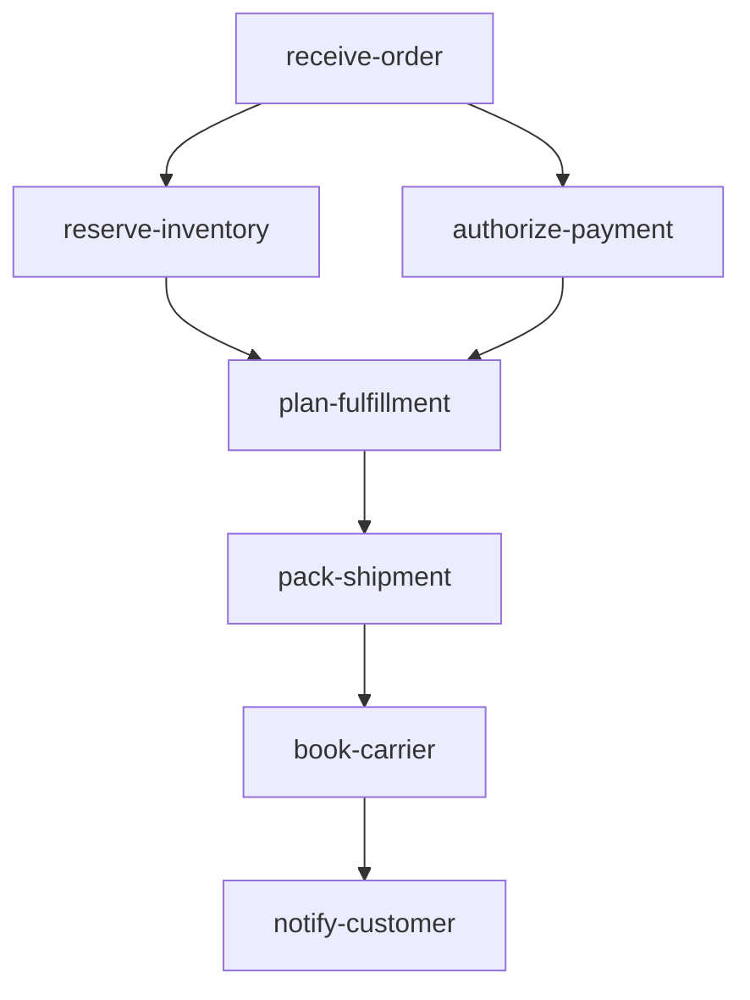

# order-fulfillment

Order fulfillment pipeline built programmatically in Go (no YAML). The DAG is
constructed in [`main.go`](./main.go) by populating a `*dag.DAG[RunState]`
with `task.Task` values, then handed to the orchestrator.

## Pipeline shape

The order is seeded via `GlobalInputs` at run start; `receive-order` logs it.
Inventory and payment authorization run
in parallel. Once both succeed, `plan-fulfillment` builds a pick list, the
package is packed, a carrier is booked, and the customer is notified.

## DAG diagram



## Notable configuration

- `ConcurrencyLimit: 2` on the DAG.
- `plan-fulfillment` short-circuits with an error if `PaymentAuthorized` is
  false — a small example of in-task state validation between fan-in nodes.
- Tracking number is derived by transforming the package ID, showing how
  downstream tasks can derive new values from earlier state.

## Run

```bash
cp ../../.env.example ../../.env
go run .
```

## Passing initial state (typed `Run`)

[`main.go`](./main.go) seeds the order in `runDAG`:

```go
run, err := orch.Run(ctx, d, orchestrator.GlobalInputs[RunState]{
    Value: RunState{
        OrderID:         "ord_1042",
        CustomerID:      "cus_77",
        CustomerEmail:   "alex@example.com",
        ShippingAddress: "120 Market St, San Francisco, CA",
        Items: []OrderItem{
            {SKU: "coffee-beans", Quantity: 2, Bin: "A-14"},
            {SKU: "ceramic-mug",  Quantity: 1, Bin: "C-02"},
        },
    },
})
```

`receive-order` only prints the seeded order and returns state unchanged.
