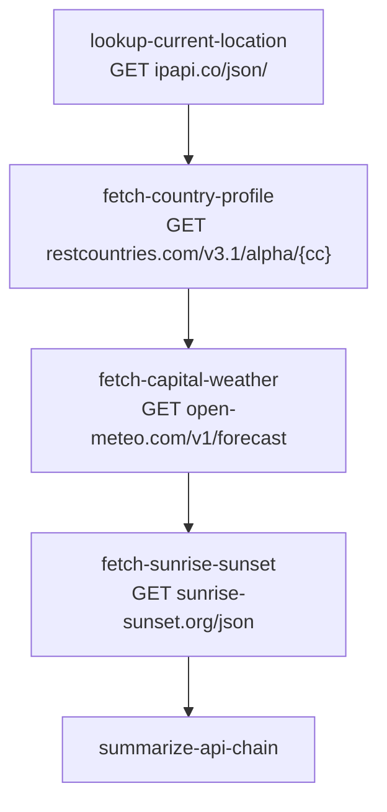

# public-api-chain-yaml

A strictly sequential chain of public HTTP APIs, declared as a YAML DAG and
executed by [`main.go`](./main.go). Each task uses the previous task's
output to construct the next request — a typical "API chain" pattern.

## Pipeline shape

1. `lookup-current-location` calls `ipapi.co` to infer the country from the
   public IP.
2. `fetch-country-profile` uses the country code to call
   `restcountries.com` and get the capital, region, population, and
   coordinates.
3. `fetch-capital-weather` uses the capital's coordinates to call
   `open-meteo.com` for current weather.
4. `fetch-sunrise-sunset` uses the same coordinates to call
   `sunrise-sunset.org` for sunrise and sunset times.
5. `summarize-api-chain` rolls everything into a single human-readable
   summary string.

## DAG diagram



## Notable configuration

- `concurrency_limit: 1` — strict serialization matches the data
  dependencies: every step needs the previous step's response.
- Every external call has `timeout: 20s`, `max_attempts: 2`, and a 500ms
  linear backoff.
- `RunState` carries the URLs of each upstream call as fields, so the
  state and provenance of every API call is captured in the run.

## Run

```bash
cp ../../.env.example ../../.env
go run .
```

## Passing initial state (typed `Run`)

This example has no natural caller-supplied inputs — `lookup-current-location`
calls `ipapi.co` to discover the country from the caller's public IP, and
every subsequent step's input is derived from the previous step's response.
The new typed `Run` adds no value here; the existing
`orch.Run(ctx, d)` form (no `GlobalInputs`) is the right fit. The initial
`RunState` is the zero value, and the first task populates it from the
network response.
