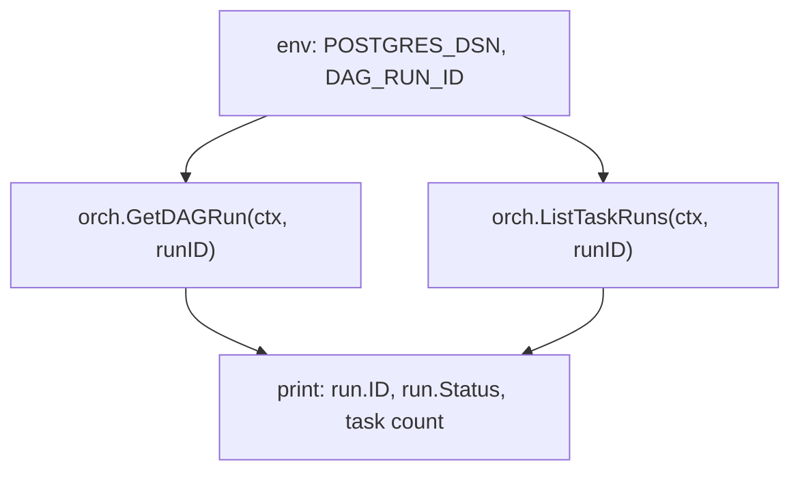

# query

A read-only inspection tool. It does not run a DAG — instead it loads an
existing run from the orchestrator's Postgres store and prints a one-line
summary.

## Flow



## What it demonstrates

- `orchestrator.GetDAGRun` — fetch the persisted run state by ID.
- `orchestrator.ListTaskRuns` — enumerate the task runs that belong to a
  given DAG run.
- A typical "did my workflow finish, and what is its status?" admin
  command, useful for CLI scripts, dashboards, or post-mortem tooling.

## Run

```bash
cp ../../.env.example ../../.env
DAG_RUN_ID=00000000-0000-0000-0000-000000000000 \
  go run .
```

## Passing initial state (typed `Run`)

This example is a read-only inspection tool that calls
`orchestrator.GetDAGRun` / `orchestrator.ListTaskRuns` and never
invokes `Run`. The typed `Run` change is unaffected on the read path.
