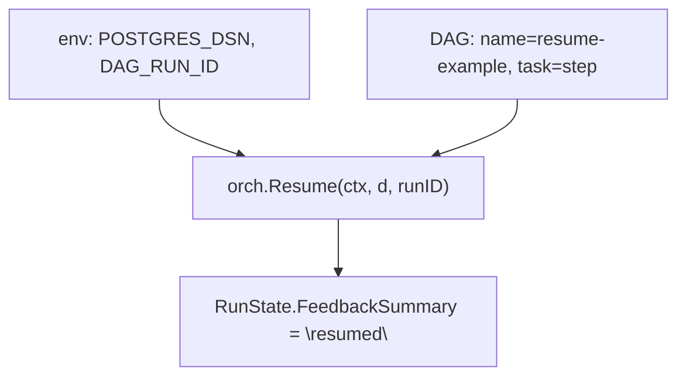

# resume

Demonstrates `orchestrator.Resume` — picking up an existing DAG run and
continuing it with a (possibly new) DAG definition. Useful when a run
crashed mid-flight and you want to retry the remaining tasks, or when you
have evolved a DAG and want to backfill new tasks into an in-progress run.

## Flow



## Pipeline shape

The DAG itself is trivial — a single `step` task that writes
`FeedbackSummary = "resumed"` to the run state. The interesting part is
that the task is executed under an *existing* run ID, not a fresh one.

## What it demonstrates

- `orchestrator.Resume(ctx, d, runID)` — re-attach to a stored run.
- How to look up the target `DAG_RUN_ID` (e.g. from a prior failed run
  discovered by the `query` example) and continue it.

## Run

```bash
cp ../../.env.example ../../.env
DAG_RUN_ID=00000000-0000-0000-0000-000000000000 \
  go run .
```

## Passing initial state (typed `Run`)

This example resumes an existing run via `orchestrator.Resume`, so the
typed `Run` change is unaffected on the resume path itself. However, the
*original* run that created the persisted `DAG_RUN_ID` could have used
the new typed `Run` to seed its initial state:

```go
_, err := orch.Run(ctx, d, GlobalInputs[RunState]{
    Value: RunState{FeedbackSummary: "starting"},
})
```

When that run fails and is later resumed, the failed task would then
start from the seeded `RunState.FeedbackSummary = "starting"` and
update it to `"resumed"`.
