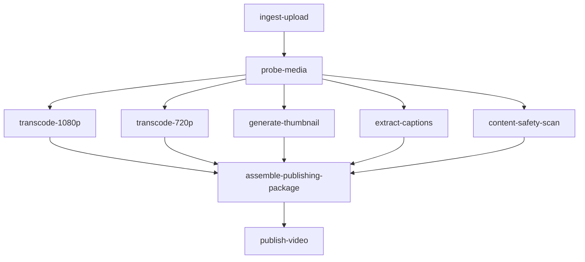

# video-publishing-yaml

A video publishing pipeline modeled as a DAG. The DAG is declared in
[`dag.yaml`](./dag.yaml) and executed by [`main.go`](./main.go), which loads
the YAML, registers the Go task functions, and runs the orchestrator against
a Postgres-backed run.

## Pipeline shape

`ingest-upload` accepts a source master, `probe-media` reads container
metadata, then five tasks fan out in parallel to produce the 1080p and 720p
renditions, a poster thumbnail, captions, and a content-safety scan. The
artifacts converge in `assemble-publishing-package`, which feeds
`publish-video`.

## DAG diagram



## Notable configuration

- `concurrency_limit: 3` on the YAML DAG (with a global 2m timeout).
- `content-safety-scan` uses `max_attempts: 2` with linear backoff.
- `transcode-1080p` and `transcode-720p` carry their own per-task `timeout: 30s`.

## Run

```bash
cp ../../.env.example ../../.env
go run .
```

## Passing initial state (typed `Run`)

[`main.go`](./main.go) seeds video metadata before the YAML DAG runs:

```go
run, err := orch.Run(ctx, d, orchestrator.GlobalInputs[RunState]{
    Value: RunState{
        VideoID:   "vid_2026_0606_launch_trailer",
        Title:     "Launch Trailer: Summer Collection",
        SourceURI: "s3://media-ingest/raw/vid_2026_0606_launch_trailer/master.mov",
    },
})
```

`ingest-upload` sets `WorkflowStarted` and logs the already-seeded
`SourceURI`.
