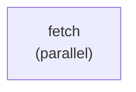

# yaml

A self-contained YAML parse / round-trip example. There is no orchestrator
run here — [`main.go`](./main.go) inlines a tiny DAG document, parses it
with `dag.ParseYAML`, and then re-serializes it via `dag.SerializeYAML`,
printing the result. It is the smallest possible end-to-end check that the
YAML schema and the in-memory `*dag.DAG` representation are in sync.

## Pipeline shape

A single task, `fetch`, with no dependencies and `execution_mode: parallel`.

## DAG diagram



## What it demonstrates

- The minimum YAML document the parser accepts.
- How a `task.FunctionRegistry` is wired up by name (`examples.fetch`).
- Round-trip stability: parse a YAML, serialize it back, and confirm the
  shape is preserved.

## Run

```bash
go run .
```

## Passing initial state (typed `Run`)

This example does not call `Run` at all — it only parses a YAML document
and serializes it back. The typed `Run` change is therefore unaffected;
the new `GlobalInputs[RunState]` parameter is a no-op for parse/serialize
round-trips.
